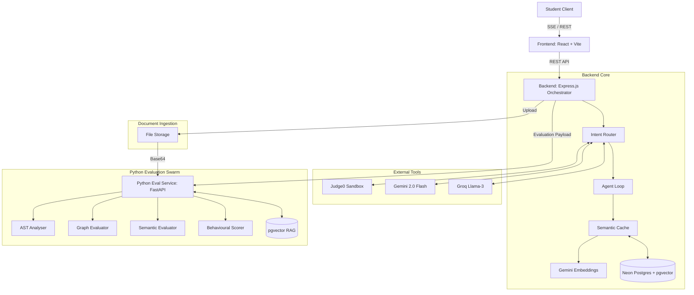

# SimExam AI

**Reimagining the future of examinations through autonomous agentic systems.**

Traditional online coding and technical assessments are static, one-dimensional, and often fail to measure true problem-solving abilities or behavioral traits. They feel like taking a standardized test rather than pair programming with a senior engineer. 

**SimExam AI** is a fully fluid, multi-modal assessment platform powered by autonomous AI agents. Instead of simply checking if test cases pass, SimExam acts as a proactive interviewer, a Socratic mentor, and a multi-layered evaluator—assessing not just *what* the candidate coded or wrote, but *how* they adapted, communicated, and resolved constraints under pressure.

---

## 🚀 Key Features

### 1. Fully Autonomous Agentic Interviewer
The core of the platform is driven by an autonomous Agent Loop that acts independently based on candidate behavior:
- **Proactive Nudges:** If the candidate stares at broken code for too long (`CODE_STALE`) or goes completely silent (`SILENCE_TIMEOUT`), the agent autonomously checks in to guide them.
- **Dynamic Curveballs:** The agent will inject unexpected requirement changes mid-exam (e.g., "The PM just said this needs to be O(N log N) instead of O(N^2)") to test adaptability.
- **Socratic Mentorship:** The agent is hard-coded to *never* give direct answers. It uses Context-Augmented Generation (CAG) and RAG to guide candidates towards the solution through inquiry.

### 2. Multi-Modal Fluidity
The platform dynamically shifts its UI and evaluation strategies based on the `assessment_type` configured by the organization:
- **Coding:** Features a real-time Code Editor and Judge0-powered Execution Terminal.
- **Conceptual:** Shifts to a Markdown-supported Essay Editor.
- **System Design:** Shifts to a Whiteboard Canvas for architectural diagramming.

### 3. Multi-Agent Evaluation Swarm
Grading isn't a simple pass/fail rules engine. It is handled by a Python microservice utilizing a 3-layer agent swarm:
- **Layer 1 (Deterministic/AST):** Analyzes Judge0 test results and parses the Abstract Syntax Tree (AST) to determine Big-O algorithmic complexity.
- **Layer 2 (Behavioural Scorer):** Analyzes the session's event log to score communication skills, hint dependency, and doubt resolution.
- **Layer 3 (Qualitative LLM/Semantic Evaluator):** Synthesizes the data into a final rubric score (Technical Accuracy, Adaptability, Communication, Efficiency) providing granular feedback on strengths and improvements.

---

## 🏗️ System Architecture

SimExam AI is built on a highly decoupled, multi-tenant architecture designed for scale and low-latency agentic interactions.



### Component Breakdown

1. **Frontend (React + Vite)**
   - Implements a fluid UI that shifts based on the assessment type — rendering the `CodeEditor` (Monaco) for coding, `RichTextEditor` (EasyMDE) for essays, or `WhiteboardCanvas` (tldraw) for system design.
   - Uses Server-Sent Events (SSE) to consume real-time streaming tokens from the LLM, providing a natural conversational flow.
   - **Proactive Inactivity Detection:** The editor components run a 60-second silence timer. If the candidate stops typing or drawing, it fires a `SILENCE_TIMEOUT` trigger to the backend's `/api/agent` route, prompting the AI to nudge them.
   - **Document Upload:** Admins can upload PDFs and other knowledge-base files through the configuration panel, which are ingested and embedded for RAG retrieval.

2. **Backend Orchestrator (Node.js/Express)**
   - Acts as the central traffic controller. Handles JWT Authentication, Role-Based Access Control (RBAC), and fetches multi-tenant configurations from the **Neon PostgreSQL** database.
   - **Intent Router & Agent Loop:** Instead of blindly passing user messages to an LLM, the backend intercepts every message, classifies the intent, and routes it through a specialized tool chain (e.g., executing code via **Judge0**, fetching docs via RAG, checking the semantic cache).
   - **Semantic Cache (pgvector):** Before every LLM call, the agent loop generates a 768-dim embedding via Gemini's `text-embedding-004` model and queries the `semantic_cache` table for cosine-similar matches. Cache hits bypass the LLM entirely, reducing both latency and API cost.
   - **Document Ingestion:** The `/api/upload` route accepts multipart file uploads (PDF, DOCX, TXT, images), validates magic bytes, persists metadata in the `uploaded_docs` table, and forwards the file to the Python service for chunking and embedding.

3. **Evaluation Microservice (Python/FastAPI)**
   - A specialized AI swarm dedicated to analyzing the session once submitted. The `Evaluator` class routes to a domain-specific evaluator based on `assessment_type`.
   - **Deterministic/AST Layer (coding):** Uses Python's `ast` module to statically analyze the candidate's final code and compute Big-O algorithmic complexity independently of standard unit tests.
   - **Graph Evaluator (system design):** Parses tldraw JSON snapshots, extracting shapes, arrows, labels, and connection patterns. Scores on node count, connectivity ratio, labeling quality, and shape diversity with weighted averages.
   - **Semantic Evaluator (conceptual):** When a Groq API key is available, uses LangChain with Llama-3 to grade essays against rubric dimensions. Falls back to deterministic heuristics (word count, paragraph structure, keyword matching) when no key is configured.
   - **RAG Engine:** Uses `pgvector` to embed and retrieve technical documentation if the candidate asks deep architectural questions during the exam.

---

## 💻 Running Locally

To run the full multi-service architecture locally, follow the steps below.

### 1. Clone the repository
```bash
git clone https://github.com/Dibyajyoti001/simexam-ai.git
cd simexam-ai
```

### 2. Database Setup (Neon/PostgreSQL)
Ensure you have a PostgreSQL database running (we recommend Neon). The backend will automatically run the schema migrations on startup.

### 3. Backend Setup
```bash
cd backend
npm install

# Create a .env file based on the required keys
# GEMINI_API_KEY=your_key
# GROQ_API_KEY=your_key
# DATABASE_URL=your_postgres_url
# PORT=3001
# FRONTEND_URL=http://localhost:5173

npm run dev
```

### 4. Python Evaluation Service
```bash
cd py_service
python -m venv venv

# Windows
venv\Scripts\activate
# Mac/Linux
# source venv/bin/activate

pip install -r requirements.txt

# Create a .env file with your API keys and the same DATABASE_URL
# GEMINI_API_KEY=your_key
# GROQ_API_KEY=your_key
# DATABASE_URL=your_postgres_url
# SERVICE_SECRET=dev_secret

fastapi run main.py --port 8000
```

### 5. Frontend Setup
```bash
cd frontend
npm install

# Create a .env.local file
# VITE_API_URL=http://localhost:3001

npm run dev
```

Visit `http://localhost:5173` to access the platform. You can access the admin dashboard to create an organization and configure your first exam!
